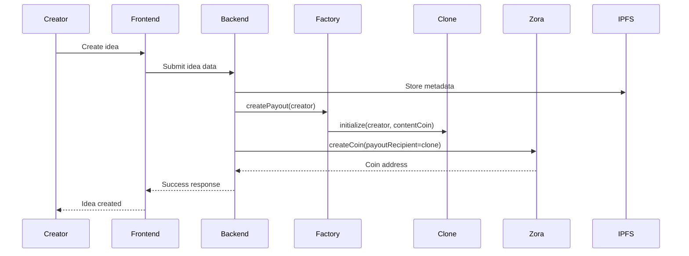
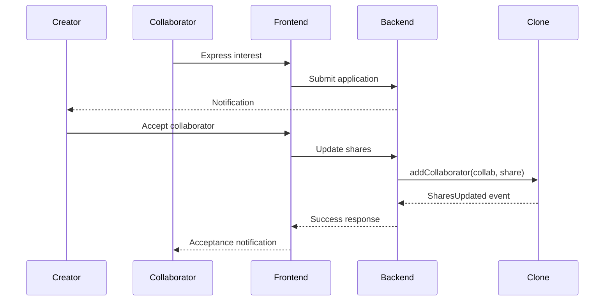
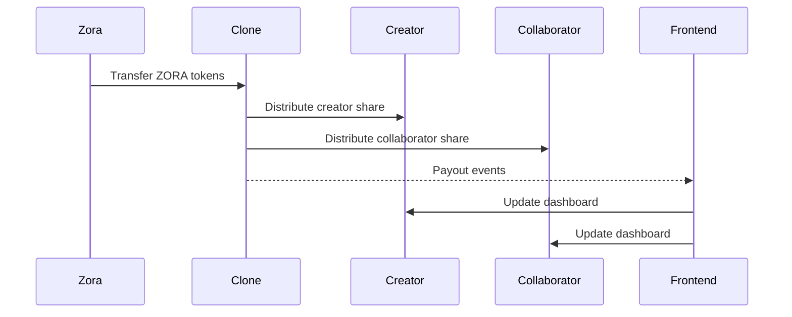

# Technical Architecture - Sideway

## System Overview

Sideway is built on a decentralized architecture that leverages Zora's Coins Protocol for content monetization and implements a clone factory pattern for efficient payout contract deployment. The system consists of smart contracts, backend services, and frontend applications working together to enable collaborative content creation with automatic revenue sharing.

## Architecture Principles

### 1. Decentralization
- Core logic and revenue distribution handled on-chain
- Immutable attribution and payment records
- No central authority controlling revenue flows

### 2. Gas Efficiency
- Clone factory pattern minimizes deployment costs
- Optimized contract interactions
- Batch operations where possible

### 3. Upgradeability
- Single implementation contract for easy maintenance
- Factory pattern enables new clone instances with updated logic
- Clear separation between logic and state

### 4. Security
- SafeERC20 for token operations
- Reentrancy protection
- Access control mechanisms
- Input validation and edge case handling

## System Components

### 1. Smart Contract Layer

#### Core Contracts
- **CollaborativePayoutImplementation**: Main logic contract containing all payout and share management functionality
- **CollaborativePayoutFactory**: Factory contract for deploying clone instances
- **ICollaborativePayout**: Interface defining contract interactions

#### Clone Pattern Benefits
- **Gas Efficiency**: ~95% gas savings compared to full contract deployment
- **Maintainability**: Single source of truth for logic updates
- **Scalability**: Unlimited clone instances from one implementation
- **Isolation**: Each clone has independent state

### 2. Zora Protocol Integration

#### Content Coin Creation
- Mint content coins via Zora SDK/factory
- Set clone address as `payoutRecipient`
- Configure currency as ZORA token
- Store metadata on IPFS

#### Revenue Flow
- Zora protocol sends creator rewards to clone address
- Clone automatically distributes ZORA tokens to stakeholders
- All distributions recorded on-chain with events

### 3. Backend Services

#### API Layer
- RESTful API for frontend integration
- GraphQL for complex queries
- WebSocket for real-time updates

#### Data Management
- Off-chain metadata storage (IPFS)
- Event indexing and caching
- User session management
- Analytics and reporting

#### Integration Services
- Zora API integration
- IPFS pinning service
- Event monitoring and indexing
- Notification services

### 4. Frontend Applications

#### Web Application
- React-based SPA
- Wallet integration (MetaMask, WalletConnect)
- Real-time collaboration features
- Dashboard and analytics

#### Mobile Application (Future)
- React Native implementation
- Native wallet support
- Push notifications
- Offline capabilities

## Data Flow Architecture

### 1. Content Creation Flow

### 2. Collaborator Addition Flow

### 3. Revenue Distribution Flow

## Technology Stack

### 1. Blockchain Layer
- **Network**: Base (Ethereum L2)
- **Smart Contracts**: Solidity ^0.8.17
- **Libraries**: OpenZeppelin Contracts
- **Development**: Foundry
- **Testing**: Forge test suite

### 2. Backend Services
- **Runtime**: Node.js
- **Framework**: Express.js
- **Database**: PostgreSQL
- **Cache**: Redis
- **Queue**: Bull/BullMQ
- **Monitoring**: Prometheus + Grafana

### 3. Frontend Applications
- **Framework**: React 18
- **State Management**: Redux Toolkit
- **UI Library**: Material-UI
- **Wallet Integration**: Web3Modal
- **Build Tool**: Vite

### 4. Infrastructure
- **Containerization**: Docker
- **Orchestration**: Kubernetes
- **CDN**: Cloudflare
- **Monitoring**: Sentry
- **Analytics**: Mixpanel

## Security Architecture

### 1. Smart Contract Security
- **Access Control**: Role-based permissions
- **Reentrancy Protection**: ReentrancyGuard
- **Input Validation**: Comprehensive checks
- **Safe Token Operations**: SafeERC20 library
- **Upgrade Safety**: Immutable implementation pattern

### 2. Application Security
- **Authentication**: JWT tokens
- **Authorization**: Role-based access control
- **Input Sanitization**: XSS protection
- **Rate Limiting**: API protection
- **HTTPS**: TLS encryption

### 3. Infrastructure Security
- **Network Security**: VPC isolation
- **Secrets Management**: HashiCorp Vault
- **Monitoring**: Security event logging
- **Backup**: Encrypted backups
- **Disaster Recovery**: Multi-region deployment

## Scalability Considerations

### 1. Smart Contract Scalability
- **Clone Pattern**: Unlimited instances from single implementation
- **Gas Optimization**: Minimal proxy pattern
- **Batch Operations**: Multiple collaborator additions
- **State Management**: Efficient storage patterns

### 2. Backend Scalability
- **Horizontal Scaling**: Microservices architecture
- **Database Sharding**: Partition by content type
- **Caching Strategy**: Multi-layer caching
- **Load Balancing**: Round-robin distribution

### 3. Frontend Scalability
- **Code Splitting**: Lazy loading
- **CDN Distribution**: Global content delivery
- **State Optimization**: Selective updates
- **Performance Monitoring**: Real-time metrics

## Monitoring and Observability

### 1. Smart Contract Monitoring
- **Event Tracking**: All contract events indexed
- **Transaction Monitoring**: Failed transaction alerts
- **Gas Usage**: Optimization tracking
- **Security Events**: Suspicious activity detection

### 2. Application Monitoring
- **Performance Metrics**: Response times, throughput
- **Error Tracking**: Exception monitoring
- **User Analytics**: Usage patterns
- **Business Metrics**: Revenue, collaboration rates

### 3. Infrastructure Monitoring
- **System Health**: CPU, memory, disk usage
- **Network Monitoring**: Latency, packet loss
- **Service Dependencies**: Health checks
- **Alert Management**: Automated notifications

## Deployment Architecture

### 1. Environment Strategy
- **Development**: Local development with testnet
- **Staging**: Production-like environment
- **Production**: Multi-region deployment
- **Testing**: Automated CI/CD pipeline

### 2. Deployment Pipeline
- **Code Repository**: Git-based version control
- **CI/CD**: GitHub Actions
- **Testing**: Automated test suites
- **Deployment**: Blue-green deployment
- **Rollback**: Automated rollback capability

### 3. Configuration Management
- **Environment Variables**: Secure configuration
- **Secrets Management**: Encrypted secrets
- **Feature Flags**: Dynamic feature control
- **A/B Testing**: Gradual rollout capability

## Integration Points

### 1. External Services
- **Zora Protocol**: Content coin creation and revenue
- **IPFS**: Decentralized metadata storage
- **Wallet Providers**: MetaMask, WalletConnect
- **Notification Services**: Email, push notifications

### 2. Internal Services
- **User Management**: Authentication and profiles
- **Content Management**: Idea and collaboration data
- **Analytics Service**: Usage and business metrics
- **Payment Service**: Revenue tracking and distribution

## Future Architecture Considerations

### 1. Multi-Chain Support
- **Cross-Chain Bridges**: Multi-chain deployment
- **Chain Selection**: User choice of network
- **Liquidity Management**: Cross-chain token flows
- **Governance**: Multi-chain voting mechanisms

### 2. Advanced Features
- **AI Integration**: Content recommendation
- **Social Features**: Creator communities
- **Marketplace Expansion**: Additional revenue streams
- **Mobile Optimization**: Native mobile experience

### 3. Performance Optimization
- **Layer 2 Solutions**: Additional scaling
- **State Channels**: Off-chain interactions
- **Sidechains**: Specialized processing
- **Optimistic Rollups**: Enhanced throughput

---

*This technical architecture document provides the foundation for system design and implementation. It should be reviewed and updated as the system evolves and new requirements emerge.*
